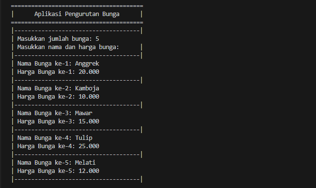

## Deskripsi Aplikasi
Aplikasi Pengurutan Bunga merupakan program berbasis Java yang dirancang untuk membantu pengguna dalam mengelola dan mengurutkan data bunga berdasarkan atribut tertentu, seperti harga atau nama bunga. Aplikasi ini memberikan pengalaman interaktif kepada pengguna melalui berbagai opsi metode pengurutan dan arah sorting, sehingga mempermudah pengguna dalam menampilkan data bunga secara rapi dan terurut.

## Fitur Aplikasi
1. Input Data Bunga:
Pengguna dapat memasukkan jumlah bunga, nama bunga, dan harga bunga.

2. Pilihan Sorting Berdasarkan Atribut:
* Sorting harga bunga:
    - Termurah ke termahal (ascending)
    - Termahal ke termurah (descending)
* Sorting nama bunga:
    - Berdasarkan alfabet A-Z (ascending)
    - Berdasarkan alfabet Z-A (descending)

3. Dua Metode Sorting:
* Selection Sort
* Bubble Sort

4. Berulang

5. Tampilan Data:
Data bunga ditampilkan sebelum dan sesudah sorting.

## Alur Aplikasi
1. Input Data
2. Pilihan Atribut Sorting
3. Metode Sorting
4. Arah Sorting
5. Tampilan Data
6. Pengulangan
7. Keluar dari aplikasi

## Screenshots
* Input data

* Pilihan Sorting berdasarkan Harga

* Tampilan Data
    * Sebelum Sorting:
    
    * Setelah Sorting:
    

* Pilihan Sorting berdasarkan Nama

* Tampilan Data
    * Sebelum Sorting:
    
    * Setelah Sorting:
    

* Keluar

